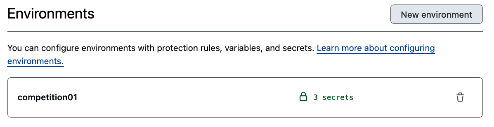
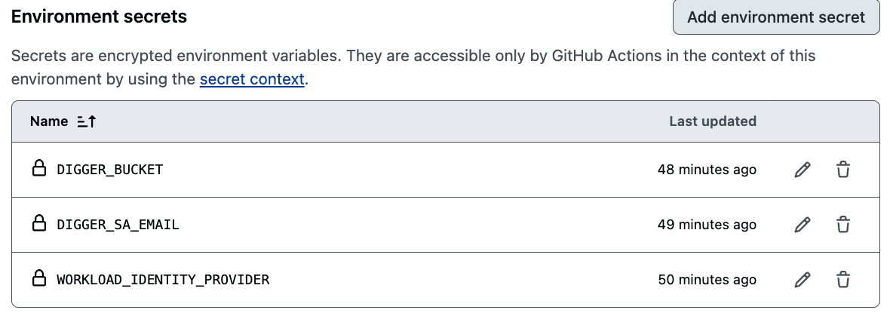

# Kaggle Infrastructure

[English](../README.md) | [日本語](README.ja.md)

Document: [Blog](https://zenn.dev/takayoshi/articles/002-kaggle-iac)

<br />

## Setup GCP Project

1. 事前に gcloud CLI を使えるようにしておきます。
   参考：[gcloud CLI をインストールする](https://cloud.google.com/sdk/docs/install?hl=ja)[Google Cloud 公式]

2. 以下のコマンドを実行します。

```shell
cd setup-gcp-project
make setup-gcp-project \
    GCP_PROJECT_ID=<your_gcp_project_id> \
    BILLING_ACCOUNT_ID=<your_billing_account_id> \
    KAGGLE_KEY=<your_kaggle_api_key> \
    TF_STATE_BUCKET_NAME=<your_tf_state_bucket_name>
```

Biiling Account ID がわからない場合は、以下のコマンドを実行して確認できます。

```shell
gcloud billing accounts list
```

<br />

## Terraform

1. `terraform/environments/competition01/terraform.tfvars` ファイルをの各種変数を各々の環境に合わせて設定してください。

2. `terraform/environments/competition01/terraform.tf` ファイルに定義されている tfstate ファイルの保存先を先ほどの`make`コマンドで作成した GCS バケットに変更してください。prefix は適宜変更してください。

```hcl
terraform {
  required_version = ">= 1.6"

  backend "gcs" {
    bucket = "your-state-bucket"  # <- GCS Bucket name
    prefix = "terraform/state"
  }

  required_providers {
    google = {
      source  = "hashicorp/google"
      version = "~> 5.30"
    }
  }
}
```

3. 以下のコマンドを実行します。

```shell
gcloud auth application-default login   # GCP 認証 (ADC)
cd terraform/environments/competition01
terraform init
terraform plan
terraform apply

# If you want to destroy the resources
terraform destroy
```

<br />

## Terraform CI/CD

ローカル環境からではなく、GitHub Actions を使用して Terraform の CI/CD を実行することが可能です。

1. GitHub Repository に自身の環境に合わせて Environments を作成します。



2. Environments の Secrets に以下の値を設定します。



3. PR 作成時に自動的に `terraform plan` が実行され、PR のコメントに結果が表示されます。

4. PR のコメントに `digger plan`・`digger apply` とコメントすることで、GitHub Actions が `terraform plan`・`terraform apply` を実行します。

参考: https://github.com/spider-man-tm/kaggle-infrastructure/pull/10

<br />

## Docker

1. このリポジトリをクローンします。
2. 既に Docker, Docker Compose がインストールされているので、以下のコマンドを実行して Kaggle コンテナを起動します。

```shell
cd docker
docker-compose up -d
```

3. VSCode から Kaggle コンテナに接続すると、Python スクリプトの実行や Jupyter Notebook の使用が可能です。
